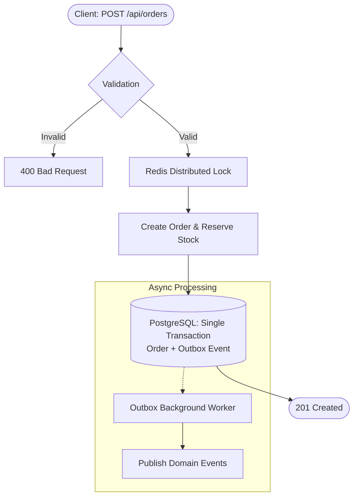

# Order Fulfillment & Inventory API

[](https://github.com/BohdanTytskyi/order-fulfillment-api/actions/workflows/ci.yml)


REST API for processing orders and managing product inventory, built with **.NET 10**, **PostgreSQL**, and **Redis**.

## Features

- **Inventory reservation with race-condition protection**: Uses Redis distributed locking during checkout to prevent overselling under high concurrency.
- **Transactional Outbox**: Saves domain events (`OrderCreatedEvent`) atomically in the same database transaction as the order, with a background worker handling reliable asynchronous dispatch.
- **Request validation & error mapping**: Pre-execution validation via MediatR pipeline behaviors and centralized RFC 7807 `ProblemDetails` error responses.
- **CQRS separation**: Commands handle domain mutations and transactions; queries handle optimized read operations.

## API Endpoints

| Method | Endpoint | Description |
| :--- | :--- | :--- |
| `POST` | `/api/orders` | Place an order and reserve stock |
| `GET` | `/api/orders/{id}` | Get order details and items |
| `POST` | `/api/products` | Create a product with initial stock |
| `GET` | `/api/products/{id}` | Get product details and current inventory |

## Order Placement Flow



## Getting Started

### Prerequisites
- .NET 10 SDK
- Docker

### 1. Start Infrastructure
```bash
docker compose up -d
```

### 2. Run the API
```bash
dotnet run --project OrderFulfillment.Api
```

- Swagger UI: `http://localhost:5200/swagger`
- Base URL: `http://localhost:5200`
- Sample HTTP requests: [`api.http`](api.http)

### 3. Run Tests
```bash
# Unit tests
dotnet test OrderFulfillment.UnitTests

# Concurrency integration tests (requires Docker containers running)
dotnet test OrderFulfillment.IntegrationTests
```
